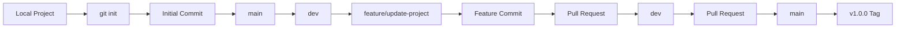

# 🚀 Task 4 — Git Version Control Project

[](https://git-scm.com/)
[](https://github.com/)
[](#-project-status)
[](#-versioning)

> A practical DevOps internship project demonstrating **Git version control, branching, commits, Pull Requests, GitHub workflow, documentation, `.gitignore`, and version tagging**.

---

## 📌 Table of Contents

* [🎯 Project Overview](#-project-overview)
* [🛠️ Tools Used](#️-tools-used)
* [📁 Project Structure](#-project-structure)
* [🌿 Branching Strategy](#-branching-strategy)
* [🔄 Git Workflow](#-git-workflow)
* [🔀 Pull Request Workflow](#-pull-request-workflow)
* [📝 Commit History](#-commit-history)
* [🏷️ Versioning](#️-versioning)
* [🚫 .gitignore](#-gitignore)
* [📚 Documentation](#-documentation)
* [📸 Evidence](#-evidence)
* [🎓 What I Learned](#-what-i-learned)
* [✅ Project Status](#-project-status)

---

## 🎯 Project Overview

The objective of this project was to manage a DevOps project using **Git best practices**.

The project demonstrates how a developer can:

* Initialize and manage a Git repository
* Create and manage multiple branches
* Develop features using feature branches
* Use meaningful commits
* Push code to GitHub
* Create and merge Pull Requests
* Maintain a proper `README.md`
* Use `.gitignore`
* Create Git tags for version identification
* Document the workflow using Markdown

---

## 🛠️ Tools Used

| Tool         | Purpose                           |
| ------------ | --------------------------------- |
| **Git**      | Version control                   |
| **GitHub**   | Remote repository & Pull Requests |
| **VS Code**  | Development & Git operations      |
| **HTML**     | Simple project landing page       |
| **Markdown** | Project documentation             |

---

## 📁 Project Structure

```text
Task-4-git-version-control/
│
├── 📄 index.html
├── 📄 README.md
├── 📄 .gitignore
│
├── 📂 docs/
│   └── 📄 git-workflow.md
│
└── 📂 screenshots/
    ├── 📸 01-feature-to-dev-merged
    ├── 📸 02-dev-to-main-merged
    ├── 📸 03-branches
    └── 📸 04-tag-v1.0.0
```

### File Purpose

| File / Folder  | Purpose                                            |
| -------------- | -------------------------------------------------- |
| `index.html`   | Project landing page                               |
| `README.md`    | Main project documentation                         |
| `.gitignore`   | Prevents unnecessary files from being tracked      |
| `docs/`        | Detailed Git workflow documentation                |
| `screenshots/` | Evidence of GitHub workflow and project completion |

---

## 🌿 Branching Strategy

This project follows a simple three-level branching workflow:

```text
main
 │
 └── dev
      │
      └── feature/update-project
```

| Branch                   | Purpose                     |
| ------------------------ | --------------------------- |
| `main`                   | Final stable version        |
| `dev`                    | Development and integration |
| `feature/update-project` | Feature development         |

---

## 🔄 Git Workflow

The project followed this workflow:



### Workflow in Simple Terms

1. Created the project locally.
2. Initialized Git.
3. Created the initial commit.
4. Set the primary branch as `main`.
5. Created the `dev` branch.
6. Created the `feature/update-project` branch.
7. Added the project landing page.
8. Committed the feature.
9. Created a Pull Request from `feature/update-project` → `dev`.
10. Merged the feature Pull Request.
11. Created a Pull Request from `dev` → `main`.
12. Merged the development changes.
13. Added project documentation and `.gitignore`.
14. Created the `v1.0.0` tag.
15. Verified the final repository state.

---

## 🔀 Pull Request Workflow

### Pull Request 1

```text
feature/update-project
          ↓
         PR
          ↓
         dev
```

**Purpose:** Merge the completed feature into the development branch.

### Pull Request 2

```text
dev
 ↓
PR
 ↓
main
```

**Purpose:** Merge the completed development work into the final stable branch.

Both Pull Requests were successfully merged.

---

<details>
<summary>📝 Click to view Commit History</summary>

### Initial Project Commit

```text
Initial project setup
```

Created the initial Git repository structure.

### Feature Commit

```text
Add project landing page
```

Added the project landing page in `index.html`.

### Documentation Commit

```text
Add project documentation and gitignore
```

Added the final README, `.gitignore`, and Markdown workflow documentation.

### Evidence Commit

```text
Add task evidence screenshots
```

Added screenshots demonstrating the completed GitHub workflow.

</details>

---

## 🏷️ Versioning

The final stable version of the project is identified using the Git tag:

```text
v1.0.0
```

The tag provides a fixed reference point for the completed project version.

---

## 🚫 .gitignore

The project uses `.gitignore` to prevent unnecessary files from being tracked.

Examples include:

```text
.env
*.log
.vscode/
.idea/
.DS_Store
Thumbs.db
```

---

## 📚 Documentation

Detailed Git workflow documentation is available here:

📄 [`docs/git-workflow.md`](docs/git-workflow.md)

It covers:

* Repository initialization
* Branching strategy
* Feature development
* GitHub remote setup
* Pull Requests
* Final verification
* Git tagging

---

## 📸 Evidence

The `screenshots/` directory contains evidence of the completed GitHub workflow.

| Evidence                   | Description                                              |
| -------------------------- | -------------------------------------------------------- |
| `01-feature-to-dev-merged` | Feature Pull Request successfully merged into `dev`      |
| `02-dev-to-main-merged`    | Development Pull Request successfully merged into `main` |
| `03-branches`              | GitHub branches                                          |
| `04-tag-v1.0.0`            | GitHub version tag                                       |

---

## 🎓 What I Learned

Through this project, I learned and practiced:

* Git repository initialization
* Git staging and commits
* Branch creation and management
* Feature branch workflow
* GitHub remote repositories
* Pull Requests
* Branch merging
* `.gitignore`
* Git tags
* Markdown documentation
* Repository verification
* Basic Git collaboration workflow

---

## 🧠 Key Git Commands

<details>
<summary>Click to view commonly used commands</summary>

```bash
git init
git add .
git commit -m "message"

git branch -M main
git switch -c dev
git switch -c feature/update-project

git remote add origin <repository-url>

git push -u origin main
git push -u origin dev
git push -u origin feature/update-project

git status
git branch -a

git pull --rebase origin main

git tag -a v1.0.0 -m "Release version 1.0.0"
git push origin v1.0.0
```

</details>

---

## ⚠️ Git Push Issue Encountered

During the project, the first push to `main` was rejected because the remote GitHub branch contained a commit that was not present locally.

The error was:

```text
[rejected] main -> main (fetch first)
```

### Resolution

```bash
git pull --rebase origin main
git push origin main
```

The histories were synchronized successfully and the push completed.

> **Key takeaway:**
> `Push rejected` usually means the remote contains changes that are missing locally. Pulling with rebase synchronizes the history before pushing.

---

## ✅ Project Status

| Requirement            | Status     |
| ---------------------- | ---------- |
| Git repository         | ✅ Complete |
| Meaningful commits     | ✅ Complete |
| `main` branch          | ✅ Complete |
| `dev` branch           | ✅ Complete |
| Feature branch         | ✅ Complete |
| Feature → Dev PR       | ✅ Merged   |
| Dev → Main PR          | ✅ Merged   |
| README.md              | ✅ Complete |
| `.gitignore`           | ✅ Complete |
| Markdown documentation | ✅ Complete |
| Git tag `v1.0.0`       | ✅ Complete |
| Evidence screenshots   | ✅ Added    |
| Final verification     | ✅ Complete |

---

## 🏁 Conclusion

This project demonstrates a practical **Git + GitHub version-control workflow** suitable for a DevOps environment.

The repository uses structured branching, meaningful commits, Pull Requests, documentation, `.gitignore`, evidence screenshots, and version tagging to maintain a clean and traceable project history.

### 🚀 Final Version

**`v1.0.0` — Completed Git Version Control Project**

---

**GitHub Repository:**
`https://github.com/nileshyadav2803/Task-4-git-version-control`
